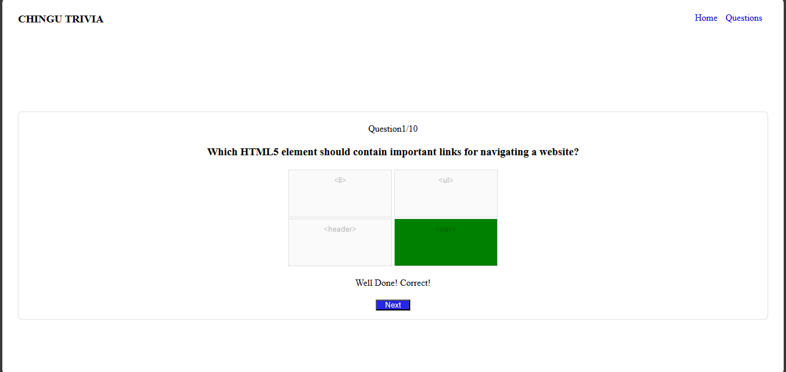

# Quiz App

## Overview

This is a simple quiz app built with vanilla JavaScript with HTML and CSS. The app allows users to answer a series of questions and provides score on their performance upon completion.

## Features

- Interactive quiz interface.
- Questions are presented one at a time.
- Users can select an answer from multiple choices.
- Immediate feedback on the correctness of each answer.
- Users can navigate to the next question after answering.
- Scores are displayed at the end of the quiz.
- App has favicon

## Access

The app can be accessed by a simple click-
[try it](https://bitscurrent.github.io/quizApp/)

## Screenshots

